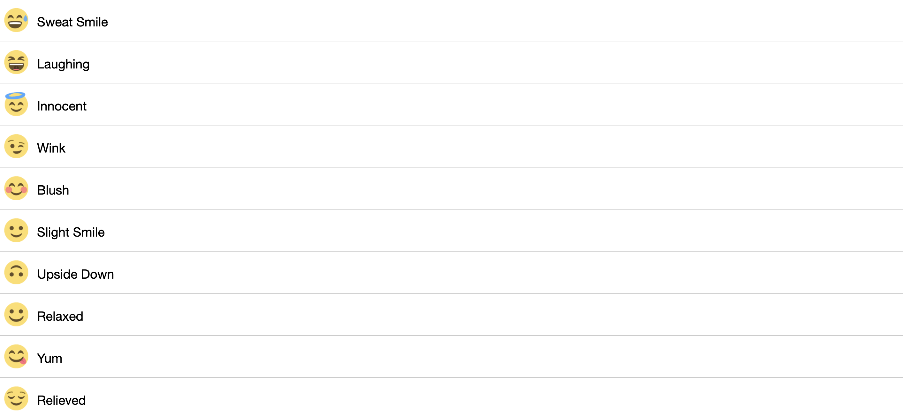

<h1>Emoji Search App</h1>

<p>Emoji Search App made using HTML, CSS,JS and React.JS.</p>

### To Do List :

<p>This app allows you to make a Emoji Search app list of emoji you want to do and you can strikeout the events completed.</p>

<h3>Used Technologies</h3>

- HTML5

- CSS3

- JavaScript 

- React.JS

#### Steps to Use:

---
* Download [Node Js and npm(Node package manager)](https://nodejs.org/en/) (when you install Node, npm also gets installed by default)

* Run command `cd todolist`.

* Run this command to install all dependencies for the project.
```
npm install
```
* Run this command to run the file.
```
npm start
```
* Open http://localhost:3000/ on your browser.

# ScreenShots




## Happy Coding!

<strong>Developed by: <a href="https://github.com/BoddepallyVenkatesh06">Venky Kumar</a>