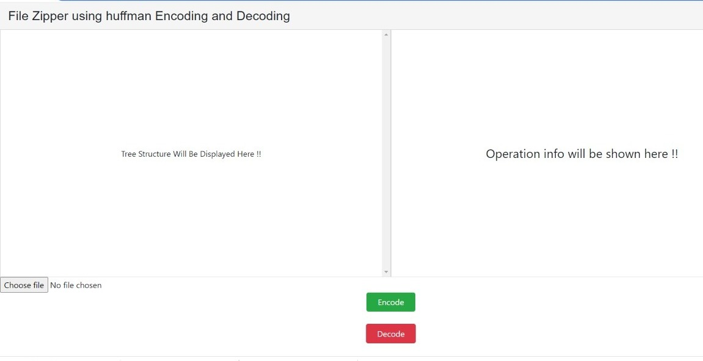

<h1>File Zipper</h1>

An Awesome encoder and decoder using huffman encoding techniques.

### Use of the Project:

It can encode and decode the text files only and downloads automatically . 

<h3>Used Technologies</h3>

- HTML5

- CSS3
  
- JavaScript

- PHP

#### Steps to Use:

---
- Go to the directory

- Run the index.html file by copying the file path and pasting it in your browser

- Upload The txt file

-  And there you have your Encoded or decoded file

<h3> ScreenShot </h3> 

## Happy Coding!

<strong>Developed by: <a href="https://github.com/BoddepallyVenkatesh06">Venky Kumar</a>
