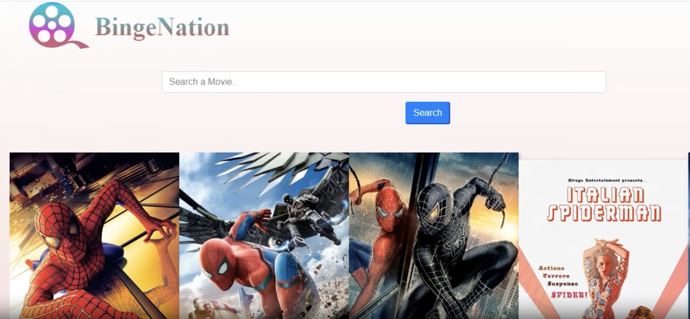

# Welcome 🖐 to the Movie App
This is a HTML, CSS, JAVASCRIPT movie website project where users can come and watch any movie from this website.

## 💻Tech Stack

### How to get the project on your local machine:

---
- Go to the directory

- Open movie-website folder

- Open index.html with live server 

### Things used in the project

Built with Vanilla JavaScript. Below is a list of the methods and properties use

* querySelector
* createElement
* innerHTML
* appendChild
* insertBefore
* preventDefault
* dataset
* parentElement
* nextElementSibling
* classList
    * add
    * remove
* fetch
* bind
* setAttribute
* onClick
* toLowerCase
* target

## ScreenShot

## Happy Coding!
<strong>Developed by: <a href=
"https://github.com/BoddepallyVenkatesh06">Venky Kumar</a>

