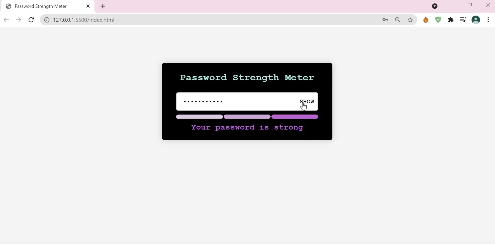

<h1>Password Strength Meter</h1>

Checks the strength of a password if it is strong, average or weak.

### Use of the Project:

User enters a password, the app shows weak password for just letters, average password for letters and numbers and strong password for letters, numbers and special characters.

### Used Technologies

- HTML5

- CSS3

- JavaScript

### Steps to Use:

---
- Go to the directory

- Run the index.html file

- Start Checking!

## ScreenShot

## Happy Coding!

<strong>Developed by: <a href=
"https://github.com/BoddepallyVenkatesh06">Venky Kumar</a>

