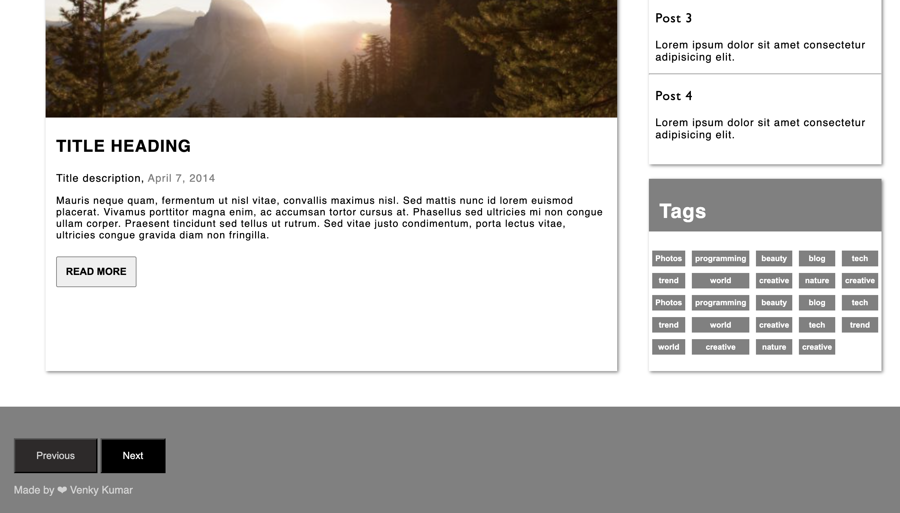

# Welcome 🖐 to the Personal Blog Wbsite Template.
It is a simple and resonsive Personal Blog Website.

## 💻Tech Stack

### How to use:

---
- Go to the directory

- Run the index.html file

- Navigate the website in different modes(desktop or mobile)

## ScreenShot View

## Happy Coding!

<strong>Developed by: <a href=
"https://github.com/BoddepallyVenkatesh06">Venky Kumar</a>