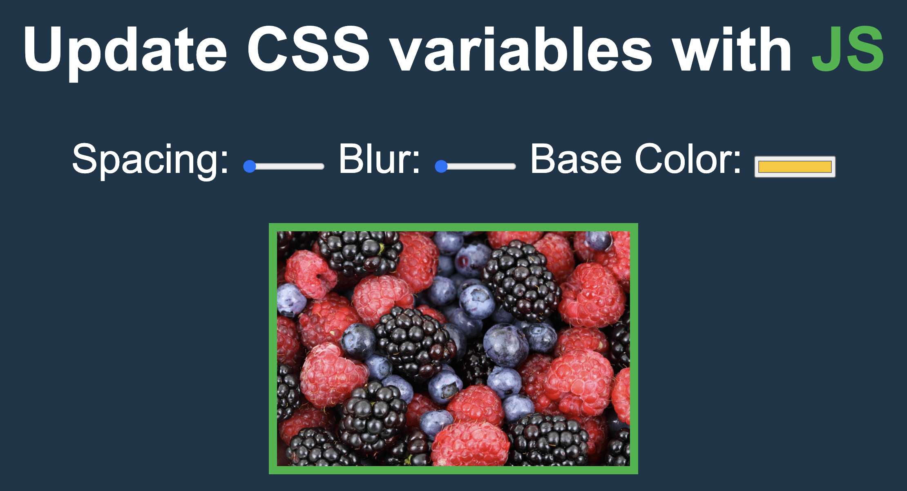

# Blur& Size Adjustment

## Description
The amount of motion blur is easily configurable, and there are additional options to enable other features such as interpolating the video's fps. This can be used to generate 'fake' motion blur through frame blending the interpolated footage.

## Stacks Used
* HTML

* Internal CSS 

## Use of Project

Blur is a program made for easily and efficiently adding motion blur to images through frame blending.

## ScreenShot

## Happy Coding!

<strong>Developed by: <a href="https://github.com/BoddepallyVenkatesh06">Venky Kumar</a>