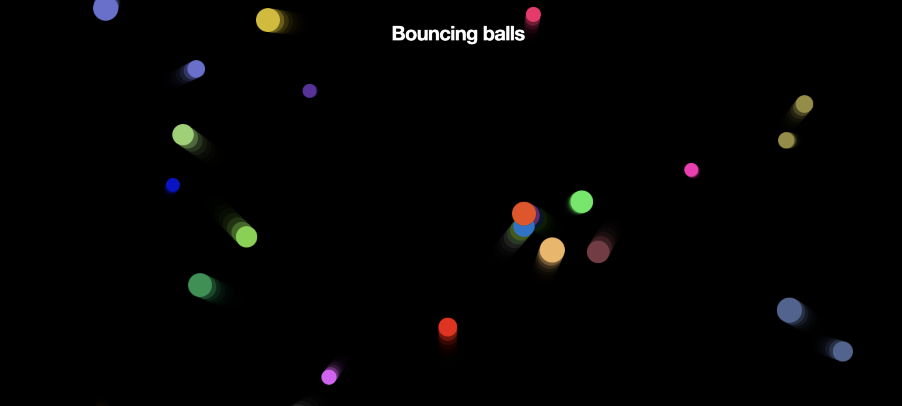

# BounceBalls

  

This page was given as a challenge in the MDN JS guide!

To show how powerful JavaScript objects can be, we use the CanvasAPI and the requestAnimationFrameAPI method to create animations across the entire screen.

### Used Technologies

  * HTML5

  * CSS3

  * JavaScript

#### Steps to Use:

---
- Go to the directory

- Run the index.html file

- Start Calculating!!

## Important Learning Points

- CanvasAPI Basics

- Understanding the prototype in JS

- Creating methods and properties

## Happy Coding!

<strong>Developed by: <a href="https://github.com/BoddepallyVenkatesh06">Venky Kumar</a>